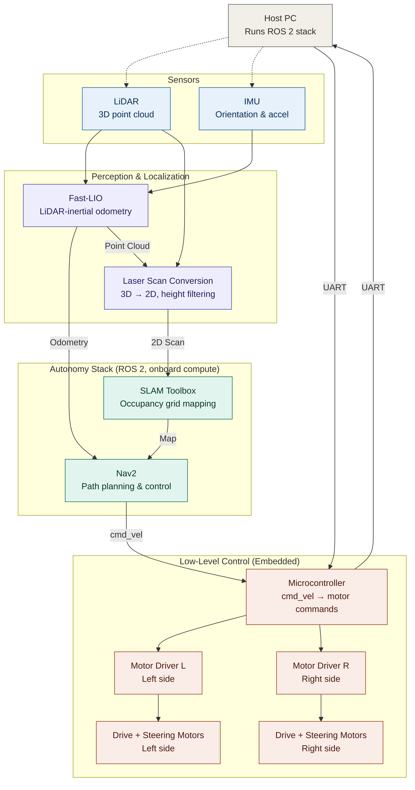

## Overview
As part of our final year project, my team — Biswash Khatiwada, Susil Chhetri, Balkrishna Poudel, and I — designed and built an Autonomous Ground Vehicle (AGV) capable of navigating unknown outdoor environments using LiDAR-based SLAM and the Nav2 navigation stack.

## My Contribution
* Set up an accurate Gazebo simulation of the robot for testing SLAM and navigation before deployment on real hardware.
* Developed the low-level hardware interface on an STM32 microcontroller responsible for converting ROS 2 `Twist` commands into motor commands, including motor kinematics and PID control.
* Wrote the ROS 2 node handling UART communication between the onboard PC and the STM32, including packet framing and robust serial data handling.
* Tuned and tested Nav2 parameters for reliable path planning and obstacle avoidance.

## Implementation Approach and Details
The chassis was built by welding together the frames of two Segways to form the base of the AGV. An onboard laptop running ROS 2 Humble on Ubuntu 22.04 served as the robot's main compute, handling perception, localization, mapping, and navigation. A 3D LiDAR provided the primary perception input, and an STM32 microcontroller handled all low-level motor control, communicating with the ROS 2 stack over UART.

The overall system architecture is shown below:

    

        {% include figure.liquid loading="eager" path="assets/img/projects/fyp/electronics_setup.png" title="Electronics setup schematic" style="height: 250px; width: 100%; object-fit: cover;" class="img-fluid rounded z-depth-1" %}
    

    

        {% include figure.liquid loading="eager" path="assets/img/projects/fyp/hardware_setup.png" title="Real hardware setup" style="height: 250px; width: 100%; object-fit: cover;" class="img-fluid rounded z-depth-1" %}
    

    Electronics schematic (left) and the assembled hardware platform (right).

Fast-LIO was used to fuse the 3D LiDAR and IMU data into a real-time LiDAR-inertial odometry estimate, which grounded the robot's pose during mapping and navigation. The resulting 3D point cloud was height-filtered and projected down to a 2D laser scan, which SLAM Toolbox consumed to build the occupancy grid map used for localization and path planning.

On the navigation side, motor kinematics and PID control were implemented directly on the STM32, which received `cmd_vel` (`Twist`) commands from the ROS 2 side over UART and converted them into per-wheel motor commands. Within Nav2, the default plugins were used for planning and control: the **DWB controller** (Dynamic Window Approach-based) as the local planner/controller, and the **NavFn planner**, which computes global paths using Dijkstra's algorithm, as the global planner. Only a subset of parameters in the `nav2_params.yaml` file were tuned from their defaults — mainly costmap inflation, controller velocity/acceleration limits, and goal tolerances — based on testing.

## Results

  

    <video width="100%" controls autoplay loop muted class="img-fluid rounded z-depth-1">
      <source src="{{ '/assets/video/projects/fyp/demo_vid.mp4' | relative_url }}" type="video/mp4">
      Your browser does not support the video tag.
    </video>
    

      The AGV autonomously mapping and navigating an outdoor environment.
    

  

Since localization relied solely on 2D laser scan matching (no additional sensor fusion for pose correction), goal-reaching accuracy varied noticeably with environment. Indoors, where structured features like walls and corners gave the scan matcher plenty to work with, the robot reached its goal with a position error of about 20 cm. Outdoors, sparser and less consistent features led to greater drift in localization, with goal position errors of around 50 cm.

    

        
    

    Difference between the commanded goal and the robot's actual stopping position, comparing indoor and outdoor runs
    --(robot was supposed to be inside the four corners).

## Learnings
This project was a deep dive into the full autonomy stack including the ROS 2 framework, SLAM Toolbox and LiDAR-inertial SLAM, path planning and navigation with Nav2, simulating the robot in Gazebo, and building and debugging the hardware and embedded electronics end-to-end. Beyond the technical skills, it was also a great exercise in integrating perception, planning, and control into one working system and ofcourse it was a lot of fun to build (and ride the robot).

## Links
* **Repository:** [github](https://github.com/manojbhatta/bail_gada)
* **Final Thesis:** [pdf]({{ '/assets/pdf/fyp.pdf' | relative_url }})