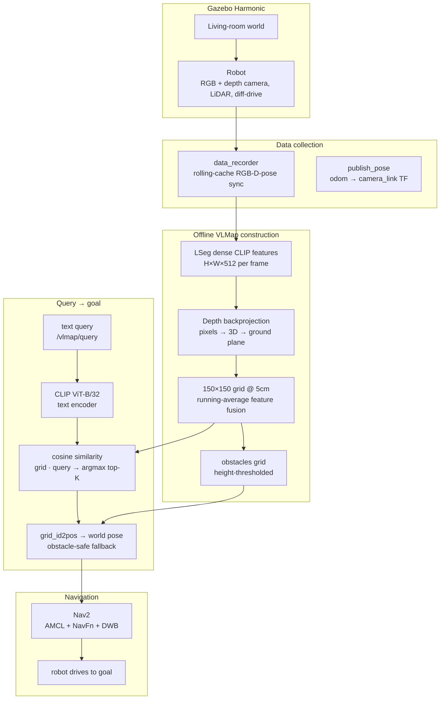

## Overview

`ov_nav` is an end-to-end, open-vocabulary navigation stack built on top of [VLMaps](https://vlmaps.github.io/), re-implemented and adapted for a **ROS 2 (Jazzy) + Gazebo (Harmonic)** pipeline instead of the original Habitat simulator.

The core idea behind this is, instead of baking a fixed list of object categories into the map, every 2D grid cell stores a dense **CLIP feature vector**. A navigation goal is then generated on the fly by encoding an *arbitrary* text query (e.g. `"rug"`, `"sofa"`) and finding the map cell whose stored features are most similar to the query embedding.

The whole system was built and tested in simulation: a custom URDF robot (RGB + depth camera, 2D LiDAR, differential drive) teleoperated through a furnished living-room world while a data recorder captured synchronized frames.

## Implementation

### 1. Dense feature extraction & mapping

- A **CLIP ViT-B/32** model provides the shared image/text embedding space (512-D).
- Per-pixel dense features come from an **LSeg** encoder (language-driven segmentation head over a CLIP ViT backbone), producing `H×W×512` feature maps per frame.
- Each RGB-D frame is backprojected using the camera intrinsics: every valid depth pixel (`z > 0.1 m`) becomes a 3D point, transformed into the map frame by the camera pose, then projected orthographically onto the ground plane.
- Points fall into a **150 × 150 grid at 0.05 m/cell** (7.5 m × 7.5 m). Each cell accumulates its observed features with an **incremental running average** (`grid = (grid·w + feat) / (w+1)`), so features are fused across frames and viewpoints.
- A parallel `obstacles` grid marks cells free/occupied by thresholding point height, and an RGB top-down image (`color_top_down`) is produced for visualization.

### 2. Query → goal

- A text query is tokenized and encoded by the **CLIP text encoder**, then L2-normalized.
- Cosine similarity with every grid cell is a single matrix product (`grid @ text_feat.T`), since cell features are also L2-normalized.
- The **top-K cells** (default K=5) are averaged to get a stable goal centroid, and the grid index is converted back to a world coordinate via `grid_id2pos`.
- Goals falling in an obstacle cell are repaired by searching the 8 surrounding cells for the nearest free one.

### 3. ROS 2 integration

Three custom nodes glue the stack together:

| Node | Responsibility |
|------|----------------|
| `data_recorder` | Manually syncs RGB, depth, and pose via a rolling-cache closest-timestamp matcher (avoids the flakiness of `ApproximateTimeSynchronizer` with Gazebo's BEST_EFFORT QoS); decimates frames with motion thresholds (Δpos ≥ 0.10 m, Δrot ≥ 5°) |
| `publish_pose` | Publishes the camera pose by looking up the `odom → camera_link` transform |
| `vlmap_to_nav2` | Subscribes to `/vlmap/query` (`std_msgs/String`), loads the prebuilt map + CLIP model, computes similarity, builds a `PoseStamped` goal, and sends it to Nav2 via the `navigate_to_pose` **action client** |

`vlmap_to_nav2` also publishes the selected goal on `/vlmap/goal_pose` for live RViz visualization, handles the VLMap↔Nav2 coordinate-frame offset via `map_origin_x/y` parameters, and uses a threshold (default 0.20) + top-K to filter spurious detections.

The occupancy grid is bridged to Nav2 two ways: a SLAM-Toolbox map (lidar) for standard `map_server`, and a small converter (`npy_nav2_map.py`) that writes the VLMap obstacle grid to `.pgm` + `.yaml`.

## Results

### CLIP similarity experiments

Before building the full map, I validated the *spatial* semantics of CLIP features by hooking the final transformer block of a **CLIP ViT-B/16** encoder to capture per-patch tokens (14×14 patches). Projecting these into the shared embedding space and computing cosine similarity against a text query shows exactly *where* the query concept lives in the image:

    

        
    

CLIP patch-level cosine similarity for the query — RGB · depth · 14×14 similarity grid · heatmap overlay.

The low-resolution patch grid is bicubic-interpolated to 224×224 and alpha-blended over the RGB frame, making the spatial correspondence between text and pixels explicit. And once these features are embedded into the every 3d point of the map to get a semantic representation, we can query the map to get the points with most similarity.

<!-- PLACEHOLDER: add clips of query -> heatmap for "rug", "sofa", "coffee table" from vlmap/assets/*.png -->

    

        
    

    Heatmap for similarity search between query 'lamp' with the vlmap (Red mark is the cluster of points with highest similarity).

### VLMap visualization

The constructed map exposes the same structure as the raw data it was built from:

    

        
    

    

        
    

    

        
    

    

        
    

(T-B,L-R)Gazebo env, Color topdown view of vlmaps, Height clipped obstacle occupancy grid, Height clipped map with semantic categories specified

<!-- PLACEHOLDER: gazebo_env.png — the living-room world used for data collection -->
<!-- PLACEHOLDER: top-down RGB map (color_top_down) and obstacle grid (from demo.ipynb) -->

### Navigation

With the Nav2 stack running (AMCL localization, NavFn global planner, DWB local planner), publishing `"lamp"` to `/vlmap/query` produces a real `NavigateToPose` goal at the lamp's grid cell, and the robot plans a collision-free path and drives there.

  

    <video width="100%" controls autoplay loop muted class="img-fluid rounded z-depth-1">
      <source src="{{ '/assets/video/projects/ov_nav/nav.mp4' | relative_url }}" type="video/mp4">
      Your browser does not support the video tag.
    </video>
    

      Robot navigating to a text-query goal.
    

  

<!-- PLACEHOLDER: RViz screenshot with goal_pose marker + planned path to the queried object -->
<!-- PLACEHOLDER: embedded video of robot navigating to a text-query goal -->

## Learning

- **Dense features are the hard part.** CLIP's image encoder is trained on global image-text pairs, so per-patch features are patchy and noisy at 14×14 resolution; LSeg's dense head is what makes pixel-level grounding usable for mapping. The map's quality is essentially the map of *where those dense features came from*.
- **Point → grid accumulation is delicate.** Cell resolution, the depth sampling rate, and the camera height all interact — too-dense sampling bloats runtime, and mis-set `camera_height` shifts the entire floor/obstacle boundary.
- **Sensor synchronization in Gazebo is a silent killer.** Approximate-time-synchronizer silently stalls when QoS or clock stamps misalign; a manual rolling-cache matcher with a `slop` window and a zero-stamp wall-clock fallback is far more debuggable — and the per-topic receive counters made diagnosing it straightforward.
- **Two maps, two frames.** The VLMap is built relative to the robot's starting pose, while Nav2 reasons in the `map` frame. Reconciliations with simple origin offsets work, but a proper `tf2` static transform (`vlmap_origin → map`) is the robust production answer.
- **The query is genuinely open-vocabulary.** Because the map stores features rather than labels, goals like `"rug"` or `"curtains"` work with zero retraining or re-indexing — the same map serves arbitrary natural-language requests.

---

## Links
* **Repository:** [github](https://github.com/manojbhatta/ov_nav)

---

**Credits:** based on *Visual Language Maps for Robot Navigation* (Chen et al., ICRA 2023) and its open-source implementation; LSeg (Li et al., CVPR 2022) for dense features; Nav2, SLAM Toolbox, and Gazebo for the simulation stack.